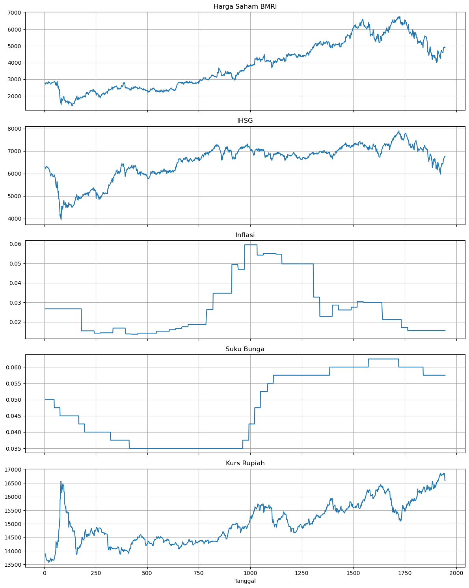
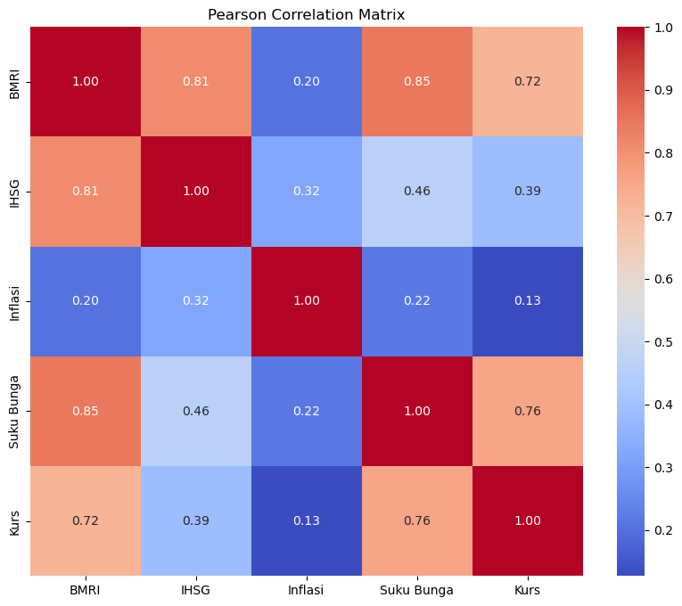
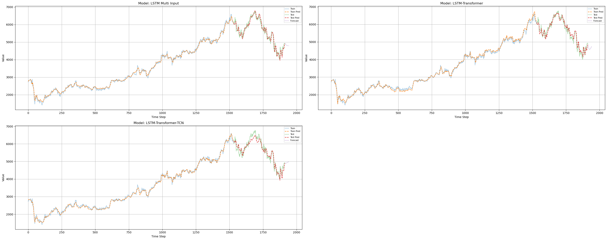

# Laporan Proyek Machine Learning - Kurniawan Chandra Wijaya
---

# Peramalan Harga Penutupan Saham BMRI dengan Mempertimbangkan Pengaruh Makroekonomi menggunakan Model Hybrid LSTM-Transformer

## Domain Proyek

### Latar Belakang

Perkembangan teknologi informasi dan komunikasi telah membawa perubahan signifikan dalam berbagai sektor, termasuk sektor keuangan. Salah satu aspek penting dalam sektor keuangan adalah prediksi harga saham, yang menjadi fokus utama dalam penelitian ini. Prediksi harga saham merupakan tantangan kompleks karena dipengaruhi oleh berbagai faktor eksternal seperti suku bunga, inflasi, dan nilai tukar mata uang asing. Oleh karena itu, diperlukan model yang mampu menangkap pola temporal dan hubungan antar variabel eksternal untuk menghasilkan prediksi yang akurat.

Dalam konteks ini, model Long Short-Term Memory (LSTM) telah terbukti efektif dalam menangani data deret waktu. Namun, untuk meningkatkan performa model, pendekatan *hybrid* seperti LSTM-Transformer dan LSTM-Transformer-TCN (Temporal Convolutional Network) dapat dipertimbangkan. Model-model ini menggabungkan keunggulan LSTM dalam menangkap dependensi jangka panjang dengan kemampuan Transformer dalam menangani hubungan antar variabel secara global.

### Relevansi Penelitian

Beberapa penelitian sebelumnya telah membahas penerapan model LSTM, Transformer, dan TCN dalam prediksi harga saham, baik secara individu maupun dalam kombinasi. Misalnya, studi oleh Ferdus et al. (2024) mengembangkan model berbasis Transformer untuk prediksi harga saham dengan memasukkan faktor eksternal seperti sentimen media sosial dan variabel makroekonomi. Selain itu, penelitian oleh Zheng (2023) memberikan tinjauan terhadap penggunaan metode LSTM dan TCN dalam prediksi harga saham, serta tantangan dan arah penelitian selanjutnya.

Pemilihan saham PT Bank Mandiri (Persero) Tbk. (BMRI) sebagai objek penelitian didasarkan pada beberapa pertimbangan berikut:

1. **Peran Strategis dalam Sistem Perbankan Indonesia**: BMRI merupakan salah satu bank terbesar di Indonesia dengan peran penting dalam perekonomian nasional. Kinerja saham BMRI sering kali mencerminkan kondisi sektor perbankan dan perekonomian Indonesia secara keseluruhan.

2. **Ketersediaan Data yang Komprehensif**: Data historis harga saham BMRI tersedia secara luas melalui platform seperti Yahoo Finance, memungkinkan analisis yang mendalam dan replikasi penelitian yang lebih mudah.

3. **Relevansi dengan Variabel Makroekonomi**: Sebagai institusi keuangan besar, kinerja saham BMRI dipengaruhi oleh berbagai faktor makroekonomi seperti suku bunga, inflasi, dan nilai tukar mata uang asing, yang sejalan dengan fokus penelitian ini.

4. **Potensi Kontribusi terhadap Praktik Investasi**: Hasil dari penelitian ini diharapkan dapat memberikan wawasan yang berguna bagi investor dan analis pasar dalam membuat keputusan investasi yang lebih informasional.

Dengan latar belakang dan pertimbangan tersebut, penelitian ini bertujuan untuk mengembangkan model prediksi harga saham BMRI yang efektif dengan memanfaatkan pendekatan *hybrid* LSTM-Transformer-TCN, serta mengeksplorasi pengaruh variabel makroekonomi terhadap akurasi prediksi.

## Business Understanding

### Problem Statements

1. Bagaimana cara memprediksi harga saham PT Bank Mandiri (Persero) Tbk (BMRI) dengan menggunakan data historis harga saham itu sendiri dan variabel eksternal seperti IHSG, inflasi, suku bunga, dan nilai tukar?
2. Model prediksi mana yang paling efektif dalam menghasilkan prediksi harga saham BMRI?

### Goals

1. Mengembangkan model prediksi harga saham BMRI yang akurat dengan mempertimbangkan data historis harga saham dan variabel eksternal.
2. Membandingkan performa berbagai model prediksi harga saham BMRI untuk memilih model terbaik.

### Solution Statements

1. Menerapkan model LSTM untuk memprediksi harga saham BMRI berdasarkan data historis harga saham dan variabel eksternal.
2. Mengembangkan model LSTM-Transformer yang menggabungkan LSTM dan Transformer untuk meningkatkan akurasi prediksi.
3. Menerapkan model LSTM-Transformer-TCN yang mengintegrasikan LSTM, Transformer, dan TCN untuk menangkap pola temporal dan hubungan antar variabel secara lebih efektif.
4. Menentukan model terbaik dengan membandingkan metrik evaluasi.

## Data Understanding

### Sumber Data

Data yang digunakan dalam penelitian ini diperoleh dari berbagai sumber resmi yang dapat diakses publik:

* **Harga Saham BMRI dan IHSG**: Data historis harga saham PT Bank Mandiri (Persero) Tbk (BMRI) dan Indeks Harga Saham Gabungan (IHSG) diperoleh dari Yahoo Finance. Tabel data dapat diakses pada laman berikut:
a.  BMRI: https://finance.yahoo.com/quote/BMRI.JK/history/
b. ^JKSE atau IHSG: https://finance.yahoo.com/quote/%5EJKSE/history/
Dataset diunduh atau dilakukan proses *scraping* menggunakan library `quantmod` di R (lihat [quantmod Documentation](https://www.quantmod.com/documentation/getSymbols.yahoo.html)), memiliki sumber yang sama dengan kedua laman di atas.
```{R}
library(quantmod)

symbol <- "BMRI.JK"
start_date <- as.Date("2020-01-01")
end_date <- as.Date("2025-05-01")

getSymbols(symbol, src = "yahoo", from = start_date, to = end_date)

bmri <- Ad(get(symbol))
bmri_df <- data.frame(Date = index(bmri), BMRI = coredata(bmri))

getSymbols("^JKSE", src = "yahoo", from = start_date, to = end_date)
ihsg <- Ad(JKSE)
ihsg_df <- data.frame(Date = index(ihsg), IHSG = coredata(ihsg))

merged_data <- merge(bmri_df, ihsg_df, by = "Date")
tail(merged_data)

write.csv(merged_data, file = "data/stock_BMRI_IHSG.csv", row.names = FALSE)
```

Data ini mencakup harga penutupan harian selama periode 1 Januari 2020 hingga 1 Mei 2025, hanya terhitung selama hari perdagangan.

* **Suku Bunga (BI-Rate)**: Data suku bunga acuan Bank Indonesia (BI-Rate) diperoleh dari situs resmi Bank Indonesia. BI-Rate merupakan suku bunga kebijakan yang digunakan oleh Bank Indonesia untuk mencapai dan memelihara stabilitas nilai Rupiah (Tabel data: https://www.bi.go.id/id/statistik/indikator/BI-Rate.aspx).

* **Inflasi**: Data inflasi tahunan (Year-on-Year) diperoleh dari situs resmi Bank Indonesia. Inflasi diukur berdasarkan Indeks Harga Konsumen (IHK) yang mencerminkan perubahan harga barang dan jasa yang dikonsumsi oleh rumah tangga (Tabel data: https://www.bi.go.id/id/statistik/indikator/data-inflasi.aspx).

* **Nilai Tukar Rupiah terhadap Dolar AS**: Data nilai tukar harian diperoleh dari situs investing.com. Nilai tukar ini merupakan data pasar yang bersumber dari berbagai penyedia likuiditas global, termasuk bank-bank besar dan lembaga keuangan internasional sehingga lebih dinamis dalam menggambarkan dinamika makroekonomi. (Tabel data: https://id.investing.com/currencies/usd-idr-historical-data).

### Variabel-variabel pada Dataset

Dataset yang digunakan dalam penelitian ini mencakup beberapa variabel penting yang diyakini mempengaruhi harga saham BMRI:

* **Harga Saham BMRI**: Harga penutupan harian saham PT Bank Mandiri (Persero) Tbk (BMRI) yang mencerminkan kinerja pasar saham perusahaan tersebut.

* **IHSG**: Indeks Harga Saham Gabungan yang mencerminkan kinerja pasar saham Indonesia secara keseluruhan.

* **Inflasi**: Tingkat inflasi tahunan yang mencerminkan perubahan harga barang dan jasa yang dikonsumsi oleh rumah tangga.

* **Suku Bunga (BI-Rate)**: Suku bunga acuan yang ditetapkan oleh Bank Indonesia sebagai kebijakan moneter.

* **Nilai Tukar**: Kurs acuan nilai tukar Rupiah terhadap Dolar AS berdasarkan nilai pasar.

### Analisis Deskriptif

Untuk memahami karakteristik data, dilakukan analisis deskriptif terhadap setiap variabel:

* **Harga Saham BMRI**: Rentang harga saham BMRI selama periode yang dianalisis menunjukkan volatilitas yang signifikan, mencerminkan dinamika pasar saham Indonesia.

* **IHSG**: Pergerakan IHSG selama periode yang dianalisis menunjukkan tren pertumbuhan yang sejalan dengan perkembangan ekonomi Indonesia.

* **Inflasi**: Tingkat inflasi menunjukkan fluktuasi yang dipengaruhi oleh faktor-faktor ekonomi domestik dan global.

* **Suku Bunga (BI-Rate)**: Perubahan BI-Rate mencerminkan respons Bank Indonesia terhadap kondisi ekonomi dan inflasi.

* **Nilai Tukar**: Fluktuasi nilai tukar Rupiah terhadap Dolar AS dipengaruhi oleh faktor-faktor eksternal seperti kondisi ekonomi global dan kebijakan moneter negara mitra dagang.

### Informasi Dataset

Dataset yang digunakan sebelum prapemrosesan data terdiri atas 1.285 baris dan 6 kolom, setelah prapemrosesan terdiri atas 1.942 baris dan 6 kolom, serta setelah *feature-engineering* terdiri atas 1.942 baris dan 21 kolom. 

Pada saat eksplorasi awal menggunakan `.info()` dan `.isna().sum()`, ditemukan bahwa terdapat missing value pada beberapa variabel, khususnya:
* Inflasi dan Suku Bunga, karena kedua variabel ini disediakan dalam frekuensi bulanan, sehingga tidak memiliki nilai untuk setiap tanggal harian;
* Kurs, meskipun harian, terkadang memiliki entri hilang akibat perbedaan hari libur nasional dan sumber data;
* Harga saham BMRI dan IHSG juga tidak tersedia pada hari libur atau akhir pekan, karena pasar tidak beroperasi.
```{python}
<class 'pandas.core.frame.DataFrame'>
RangeIndex: 1285 entries, 0 to 1284
Data columns (total 6 columns):
 #   Column      Non-Null Count  Dtype         
---  ------      --------------  -----         
 0   Date        1285 non-null   datetime64[ns]
 1   BMRI        1285 non-null   float64       
 2   IHSG        1285 non-null   float64       
 3   Inflasi     33 non-null     float64       
 4   Suku Bunga  64 non-null     float64       
 5   Kurs        1285 non-null   float64       
dtypes: datetime64[ns](1), float64(5)
memory usage: 60.4 KB
```

Jumlah total *missing value* terdeteksi dalam eksplorasi awal sebagai berikut:
```{python}
data.isna().sum()
```
yang menghasilkan
```{python}
Date             0
BMRI             0
IHSG             0
Inflasi       1252
Suku Bunga    1221
Kurs             0
dtype: int64
```

Terdapat nol *missing value* untuk kolom tanggal, saham BMRI, IHSG, dan Kurs, sedangkan *missing value* pada Inflasi sebesar 1.252 *entry* dan pada Suku Bunga sebesar 1.221 *entry*. Nilai-nilai hilang ini penting untuk ditangani sebelum digunakan dalam pemodelan agar model dapat belajar dari data yang bersih dan lengkap.

### Visualisasi Data

Untuk memberikan gambaran yang lebih jelas mengenai pergerakan variabel-variabel tersebut, berikut disajikan beberapa grafik.



* **Grafik Harga Saham BMRI**: Menunjukkan pergerakan harga saham BMRI selama periode yang dianalisis.

* **Grafik IHSG**: Menunjukkan pergerakan IHSG selama periode yang dianalisis.

* **Grafik Inflasi**: Menunjukkan fluktuasi tingkat inflasi selama periode yang dianalisis.

* **Grafik Suku Bunga (BI-Rate)**: Menunjukkan perubahan BI-Rate selama periode yang dianalisis.

* **Grafik Nilai Tukar**: Menunjukkan fluktuasi nilai tukar Rupiah terhadap Dolar AS selama periode yang dianalisis.

Grafik ini menunjukkan bahwa harga saham BMRI dan IHSG cenderung naik meski ada fluktuasi, sementara inflasi dan suku bunga meningkat bersamaan pada periode tertentu sebagai respons kebijakan moneter. Kenaikan suku bunga tampaknya digunakan untuk menekan inflasi, yang juga memengaruhi pergerakan kurs rupiah yang relatif fluktuatif sepanjang waktu.

Analisis multivariat dengan menggunakan matriks korelasi (Pearson) menghasilkan visualisasi sebagai berikut.

Melalui uji hipotesis untuk korelasi Pearson menghasilkan informasi bahwa semua variabel eksogen memiliki korelasi yang signifikan terhadap saham BMRI.
```{python}
Correlation between BMRI and IHSG: 0.8109, p-value: 0.0000
Correlation between BMRI and Inflasi: 0.2045, p-value: 0.0000
Correlation between BMRI and Suku Bunga: 0.8499, p-value: 0.0000
Correlation between BMRI and Kurs: 0.7203, p-value: 0.0000
```

## Data Preparation

### 1. Penyesuaian Dataset
Dataset awal memiliki format yang tidak seragam karena setiap variabel disediakan dalam *file* atau sumber terpisah. Oleh karena itu, seluruh data perlu digabungkan menjadi satu bentuk data tabular terstruktur dengan format akhir sebagai berikut:

| Date       | BMRI      | IHSG      | Inflasi | Suku Bunga | Kurs     |
|------------|-----------|-----------|---------|------------|----------|
| 2020-01-02 | 2800.03   | 6283.58   | 0.0267  | 0.0500     | 13889.00 |
| 2020-01-03 | 2790.99   | 6323.47   | 0.0267  | 0.0500     | 13915.00 |
| ...        | ...       | ...       | ...     | ...        | ...      |

> Catatan: Nilai di atas adalah ilustrasi hasil penggabungan data harian dari harga saham, indeks pasar, dan variabel makroekonomi yang telah diselaraskan berdasarkan tanggal.

Adapun struktur awal dari masing-masing dataset sebelum digabung adalah sebagai berikut:

- Data harga saham BMRI dan IHSG (diambil dari Yahoo Finance):

| Date       | BMRI.JK.Adjusted | JKSE.Adjusted |
|------------|------------------|----------------|
| 2020-01-02 | 2800.025879      | 6283.581055    |
| 2020-01-03 | 2790.993408      | 6323.465820    |
| 2020-01-06 | 2745.831543      | 6257.402832    |
| 2020-01-07 | 2745.831543      | 6279.346191    |
| 2020-01-08 | 2709.702148      | 6225.686035    |

- **Data Inflasi** (sumber: Bank Indonesia):

| Unnamed: 0     | Unnamed: 1   | Unnamed: 2     | Unnamed: 3 |
|----------------|--------------|----------------|------------|
| NaN            | NaN          | NaN            | NaN        |
| Data Inflasi   | Data Inflasi | Data Inflasi   | Data Inflasi |
| NaN            | NaN          | NaN            | NaN        |
| No             | Periode      | Data Inflasi   | NaN        |
| 1              | April 2025   | 1.95 %         | NaN        |

- **Data Suku Bunga BI-Rate** (sumber: Bank Indonesia):

| Unnamed: 0   | Unnamed: 1     | Unnamed: 2   | Unnamed: 3 |
|--------------|----------------|--------------|------------|
| NaN          | NaN            | NaN          | NaN        |
| BI-7Day-RR   | BI-7Day-RR     | BI-7Day-RR   | BI-7Day-RR |
| NaN          | NaN            | NaN          | NaN        |
| NO           | Tanggal        | BI-7Day-RR   | NaN        |
| 1            | 23 April 2025  | 5.75 %       | NaN        |

- **Data Kurs USD/IDR** (sumber: investing.com):

| Date       | Price     | Open      | High      | Low       | Vol. | Change % |
|------------|-----------|-----------|-----------|-----------|------|-----------|
| 05/01/2025 | 16,600.0  | 16,600.0  | 16,600.0  | 16,600.0  | NaN  | 0.00%     |
| 04/30/2025 | 16,600.0  | 16,715.0  | 16,742.5  | 16,597.5  | NaN  | -0.95%    |
| 04/29/2025 | 16,760.0  | 16,810.0  | 16,815.0  | 16,759.5  | NaN  | -0.56%    |
| 04/28/2025 | 16,855.0  | 16,835.0  | 16,867.0  | 16,830.0  | NaN  | 0.15%     |
| 04/25/2025 | 16,830.0  | 16,825.0  | 16,842.5  | 16,807.5  | NaN  | -0.24%    |

### 2. Pembersihan dan Konversi Format

#### a. Dataset Saham

Kolom `Date` dikonversi ke format datetime agar dapat digunakan sebagai index utama dalam penggabungan data.

```{python}
saham['Date'] = pd.to_datetime(saham['Date'])
```

#### b. Dataset Inflasi

Data memiliki beberapa baris *header* tambahan sehingga perlu dibersihkan menggunakan `.iloc[]`, dan tanggal dikonversi ke format datetime berbasis bulan.

```{python}
inflasi = inflasi.iloc[3:, 1:3] # Menyeleksi header dan informasi yang tidak relevan
inflasi.columns = inflasi.iloc[0]
inflasi = inflasi[1:].reset_index(drop=True)

bulan_map = {'Januari': 1, 'Februari': 2, 'Maret': 3, 'April': 4, 'Mei': 5, 'Juni': 6,
             'Juli': 7, 'Agustus': 8, 'September': 9, 'Oktober': 10, 'November': 11, 'Desember': 12}

def ubah_ke_datetime(bulan_tahun):
    try:
        bulan, tahun = bulan_tahun.split()
        return pd.Timestamp(year=int(tahun), month=bulan_map[bulan], day=1)
    except:
        return pd.NaT

inflasi['Periode'] = inflasi['Periode'].apply(ubah_ke_datetime)
```

#### c. Dataset Suku Bunga

Pembersihan struktur mirip dengan inflasi. Format tanggal mencakup hari, sehingga konversi dilakukan lebih lengkap.

```{python}
bunga = bunga.iloc[3:, 1:3] # Menyeleksi header dan informasi yang tidak relevan
bunga.columns = bunga.iloc[0]
bunga = bunga[1:].reset_index(drop=True)

def ubah_ke_datetime_lengkap(tanggal_str):
    try:
        tgl, bulan, tahun = tanggal_str.split()
        return pd.Timestamp(year=int(tahun), month=bulan_map[bulan], day=int(tgl))
    except:
        return pd.NaT

bunga['Tanggal'] = bunga['Tanggal'].apply(ubah_ke_datetime_lengkap)
```

#### d. Dataset Kurs

Data kurs sudah cukup bersih, hanya perlu mengubah format tanggal.

```{python}
kurs = kurs[['Date', 'Price']]
kurs['Date'] = pd.to_datetime(kurs['Date'], format='%m/%d/%Y', errors='coerce')
```

### 3. Penggabungan Dataset

Seluruh dataset digabung menggunakan `left join` berdasarkan tanggal dari harga saham BMRI sebagai referensi utama karena merupakan variabel endogen.

```{python}
data = saham.copy()
data = data.merge(inflasi, how='left', left_on='Date', right_on='Periode')
data = data.merge(bunga, how='left', left_on='Date', right_on='Tanggal')
data = data.merge(kurs, how='left', on='Date')
```

### 4. Penyesuaian Kolom dan Format Numerik

Beberapa kolom memiliki format string seperti `'5.75 %'` atau `'16,600'`. Kolom-kolom ini perlu dikonversi ke tipe float dan disesuaikan namanya.

```{python}
data = data.rename(columns={
    'BMRI.JK.Adjusted': 'BMRI',
    'JKSE.Adjusted': 'IHSG',
    'Data Inflasi': 'Inflasi',
    'BI-7Day-RR': 'Suku Bunga',
    'Price': 'Kurs'
})
data = data.drop(columns=['Periode', 'Tanggal'])

data['Inflasi'] = data['Inflasi'].str.replace('%', '').str.strip().astype(float) / 100
data['Suku Bunga'] = data['Suku Bunga'].str.replace('%', '').str.strip().astype(float) / 100
data['Kurs'] = data['Kurs'].str.replace(',', '').astype(float)
```

### 5. Penanganan Missing Values dan Penyesuaian Waktu

Untuk menjaga kontinuitas data, inflasi dan suku bunga diisi dengan `ffill()` dan `bfill()` karena sifatnya tidak berubah drastis antar periode.

```{python}
data['Inflasi'] = data['Inflasi'].ffill().bfill()
data['Suku Bunga'] = data['Suku Bunga'].ffill().bfill()
```

Secara matematis, pendekatan pengisian nilai hilang pada data *time series* disesuaikan dengan karakteristik alami tiap variabel. Untuk variabel makroekonomi seperti inflasi dan suku bunga, yang bersifat diskrit dan hanya diperbarui secara berkala (misalnya bulanan atau sesuai jadwal kebijakan), digunakan metode *forward fill* (`ffill()`) untuk mengisi nilai harian setelah tanggal rilis terakhir, dan *backward fill* (`bfill()`) untuk mengisi hari-hari sebelum tanggal rilis pertama dalam data. Secara formal, pendekatan ini mengasumsikan bahwa nilai variabel tetap konstan dalam suatu rentang waktu, yaitu $x_t = x_{t_k}$ untuk setiap $t \in (t_k, t_{k+1})$, dengan $x_{t_k}$ adalah nilai terakhir yang diketahui. Jika nilai sebelum tanggal rilis pertama dibutuhkan, maka diasumsikan $x_t = x_{t_1}$ untuk $t < t_1$, sehingga diterapkan *backward fill*. Setelah pengisian ini, barulah interpolasi linier berbasis waktu digunakan untuk variabel yang lebih bersifat kontinu dan fluktuatif, seperti harga saham dan kurs, guna memperkirakan nilai pada hari-hari tidak terobservasi seperti akhir pekan atau hari libur bursa.

### 6. Interpolasi Data

Perlu diperhatikan bahwa harga saham hanya tersedia pada hari perdagangan (*trading days*), sehingga interval waktu antar observasi tidak selalu konstan secara harian. Oleh karena itu, pada hari-hari non-perdagangan, data dianggap *missing* dan nilai-nilai tersebut diestimasi melalui interpolasi.

```{python}
data.set_index('Date', inplace=True)
full_dates = pd.date_range(start='2020-01-02', end='2025-05-01', freq='D')
data = data.reindex(full_dates)
data = data.interpolate(method='time')
```

Metode interpolasi berbasis waktu (*time-based interpolation*) menggunakan informasi waktu sebagai variabel independen untuk memperkirakan nilai data yang hilang secara kontinu. Secara matematis, nilai interpolasi pada waktu $t$, yaitu $y(t)$, dihitung dengan linear interpolation antara dua titik waktu terdekat $t_0$ dan $t_1$ dengan nilai data $y_0$ dan $y_1$, sesuai rumus:

$$
y(t) = y_0 + (y_1 - y_0) \times \frac{t - t_0}{t_1 - t_0} \quad \text{untuk } t_0 \leq t \leq t_1, \tag{1}
$$

dengan $t$, $t_0$, dan $t_1$ dinyatakan dalam skala waktu (misalnya *timestamp* atau *ordinal date*). Dengan demikian, interpolasi mempertimbangkan jarak waktu sebenarnya antar titik data, sehingga estimasi nilai *missing* lebih akurat dibanding interpolasi biasa yang hanya berdasarkan indeks posisi data.

### 7. Pembuatan Fitur *Lag*

Fitur *lag* dibuat untuk variabel eksogen seperti IHSG, inflasi, suku bunga, dan nilai tukar, sebanyak 5 *lag* (hari sebelumnya). Pemilihan 5 *lag* didasarkan pada asumsi bahwa pengaruh variabel makroekonomi terhadap harga saham BMRI dapat bertahan hingga lima hari kerja sebelumnya, yang juga mencerminkan pola mingguan pasar keuangan yang umum. Dengan memasukkan beberapa *lag*, model dapat mempelajari dinamika temporal serta keterlambatan efek variabel eksogen terhadap harga saham. Dengan demikian, pada waktu $t$, model menggunakan variabel eksogen dari waktu $t-1, t-2, \ldots, t-5$ sebagai input fitur. Secara matematis:

$$
\text{Input pada waktu } t = \{X_{1,t-1}, X_{1,t-2}, \ldots, X_{1,t-5},\ldots, X_{5,t-5}\}, \tag{2}
$$

dengan $X_{m,t-n}$ adalah nilai variabel eksogen ke-$m$ pada lag ke-$n$.

Variabel eksogen pada waktu $t$ tidak digunakan sebagai *input* karena pada praktik nyata, nilai eksogen pada hari yang sama dengan target harga saham belum tentu tersedia secara *real-time* saat prediksi harus dilakukan. Selain itu, penggunaan variabel eksogen pada waktu $t$ yang diketahui bersamaan dengan harga saham akan menyebabkan model “melihat masa depan”, sehingga inti dari prediksi menjadi hilang dan mengurangi validitas hasil.

Dengan demikian, menggunakan *lag* variabel eksogen memungkinkan model belajar hubungan kausal dan temporal yang realistis antara variabel makroekonomi masa lalu dengan harga saham saat ini.

Perlu diperhatikan bahwa penambahan fitur *lag* menyebabkan munculnya *missing value* pada data, karena setiap nilai *lag* mengacu pada observasi sebelumnya yang tidak tersedia untuk baris-baris awal dalam deret waktu. Oleh karena itu, *missing value* ini akan dihapuskan sebelum dinormalisasi.

### 8. Normalisasi Data dengan RobustScaler

Untuk mengatasi outlier yang sering muncul di data keuangan, digunakan *Robust Scaler*. Ini menormalkan data berdasarkan median dan interquartile range (IQR), sehingga lebih stabil dibandingkan *MinMaxScaler* atau *StandardScaler*.

Dirumuskan sebagai berikut.

$$X_{\text{scaled}} = \frac{X - \text{median}(X)}{\text{IQR}(X)}, \tag{3}$$

dengan:

* $\text{median}(X)$ adalah median dari fitur $X$,

* $\text{IQR}(X) = Q_3 - Q_1$, dengan $Q_1$ dan $Q_3$ adalah kuartil pertama dan ketiga.


### 9. Penyusunan Sequence untuk Model LSTM

*Input* data diatur dalam bentuk *sequence* dengan panjang 28 hari (*sequence length* = 28), yaitu satu bulan (4 minggu). Jadi, setiap data *input* merupakan *array* tiga dimensi dengan bentuk:

$$(\text{batch size}, \text{sequence length}, \text{jumlah fitur}).$$

*Output* target adalah harga saham BMRI pada hari berikutnya setelah *sequence input*.

### 10. Pembagian Data

Data dibagi menjadi data pelatihan (80%) dan data pengujian (20%) secara berurutan untuk menjaga aspek temporal.

Persiapan data untuk analisis dilakukan dengan kode dan langkah-langkah berikut.

```{python}
import pandas as pd
import numpy as np
from sklearn.preprocessing import RobustScaler

SEQ_LEN = 28
LAGS = 5
endog_cols = ['BMRI']
exog_cols = ['IHSG', 'Inflasi', 'Bunga', 'Kurs']

# Buat fitur lag untuk eksogen
for col in exog_cols:
    for lag in range(1, LAGS + 1):
        df[f'{col}_lag{lag}'] = df[col].shift(lag)
df.dropna(inplace=True) # Untuk menghilangkan data tanpa ketersediaan lag

# Menghapus eksogen pada waktu ke-t
df.drop(columns=exog_cols, inplace=True)

# Scaling pada endogen dan eksogen
cols_to_scale = endog_cols + [f'{col}_lag{lag}' for col in exog_cols for lag in range(1, LAGS + 1)]

scaler = RobustScaler()
scaled_values = scaler.fit_transform(df[cols_to_scale])
scaled_df = pd.DataFrame(scaled_values, columns=cols_to_scale, index=df.index)

# Fungsi untuk buat sequence LSTM multi-input
def create_sequences(data, seq_len, endog_cols, exog_cols, lags):
    X_endog, X_exog, y = [], [], []
    exog_lag_cols = [f'{col}_lag{lag}' for col in exog_cols for lag in range(1, lags + 1)]
    for i in range(seq_len, len(data)):
        X_endog.append(data[endog_cols].iloc[i-seq_len:i].values)
        X_exog.append(data[exog_lag_cols].iloc[i-seq_len:i].values)
        y.append(data[endog_cols].iloc[i].values)
    return np.array(X_endog), np.array(X_exog), np.array(y)

X_endog, X_exog, y = create_sequences(scaled_df, SEQ_LEN, endog_cols, exog_cols, LAGS)

# Split data 80:20 (berurutan karena time series)
split_idx = int(len(X_endog) * 0.8)
X_endog_train, X_endog_test = X_endog[:split_idx], X_endog[split_idx:]
X_exog_train, X_exog_test = X_exog[:split_idx], X_exog[split_idx:]
y_train, y_test = y[:split_idx], y[split_idx:]
```

## Modeling

### 1. Long Short-Term Memory (LSTM)

LSTM adalah jenis Recurrent Neural Network (RNN) yang dirancang untuk mengatasi masalah *vanishing gradient* pada RNN biasa sehingga mampu menangkap dependensi jangka panjang dalam data urutan.

Pada setiap *timestep* $t$, LSTM memproses input $x_t$, hidden state sebelumnya $h_{t-1}$, dan cell state sebelumnya $C_{t-1}$ melalui mekanisme gerbang (gates) sebagai berikut:

* **Forget Gate**: Mengontrol informasi mana dari cell state lama yang akan dibuang

$$
f_t = \sigma \left( W_f \cdot [h_{t-1}, x_t] + b_f \right)
\tag{4a}
$$

* **Input Gate**: Menentukan informasi baru apa yang akan disimpan ke cell state

$$
i_t = \sigma \left( W_i \cdot [h_{t-1}, x_t] + b_i \right)
\tag{4b}
$$

$$
\tilde{C}_t = \tanh \left( W_C \cdot [h_{t-1}, x_t] + b_C \right)
\tag{4c}
$$

* **Update Cell State**: Mengkombinasikan informasi lama dan baru

$$
C_t = f_t \odot C_{t-1} + i_t \odot \tilde{C}_t
\tag{4d}
$$

* **Output Gate**: Mengontrol output hidden state

$$
o_t = \sigma \left( W_o \cdot [h_{t-1}, x_t] + b_o \right)
\tag{4e}
$$

$$
h_t = o_t \odot \tanh(C_t)
\tag{4f}
$$

Di sini, $\sigma$ adalah fungsi sigmoid, $\odot$ adalah perkalian elemen per elemen, dan $W$ serta $b$ adalah bobot dan bias yang dipelajari. Mekanisme ini memungkinkan LSTM memilih informasi mana yang penting untuk diingat atau dilupakan sepanjang waktu.

### 2. Transformer (Self-Attention)

Transformer menggunakan mekanisme *self-attention* untuk memproses urutan data secara paralel dan menangkap hubungan antar elemen dalam urutan tanpa memperhatikan jarak posisi.

Pada *layer* *multihead attention*, setiap *input* diubah menjadi tiga representasi, yaitu query $Q$, *key* $K$, dan value $V$ dengan formula

$$
Q = XW^Q, \quad K = XW^K, \quad V = XW^V,
\tag{5a}
$$

dengan $X$ adalah input dan $W^Q, W^K, W^V$ adalah matriks bobot.

*Attention score* dihitung dengan menghitung *dot product* dari query dan *key*, kemudian dinormalisasi, yaitu

$$
\text{Attention}(Q, K, V) = \text{softmax}\left( \frac{QK^T}{\sqrt{d_k}} \right) V,
\tag{5b}
$$

dengan $d_k$ adalah dimensi *key* (skala normalisasi).

Multi-head attention membagi query, *key*, dan value menjadi $h$ kepala, menghitung perhatian secara paralel, lalu menggabungkan hasilnya:

$$
\mathrm{MultiHead}(Q, K, V) = \mathrm{Concat}(\text{head}_1, \ldots, \text{head}_h) W^O,
\tag{5c}
$$

dengan

$$
\text{head}_i = \text{Attention}(Q_i, K_i, V_i). \tag{5d}
$$

Setelah itu, ada layer normalisasi, *residual connection*, dan *feed-forward*:

$$
\mathrm{FFN}(x) = \max(0, xW_1 + b_1)W_2 + b_2
\tag{5e}
$$

Mekanisme *self-attention* memungkinkan model menangkap interaksi antar fitur di seluruh *sequence* secara efektif. Transformer berguna untuk menangkap dinamika dari variabel eksogen terhadap variabel endogen. 

### 3. Temporal Convolutional Network (TCN)

Temporal Convolutional Network (TCN) adalah arsitektur berbasis *Convolutional Neural Network* (CNN) yang dirancang khusus untuk data runtun waktu, dengan keunggulan menangkap dependensi jangka panjang secara efisien dan stabil. TCN menggunakan dua komponen utama:

#### a. Causal Convolution

*Causal convolution* menjamin bahwa prediksi pada waktu $t$ hanya dipengaruhi oleh *input* pada waktu $t$ dan sebelumnya, sehingga mencegah kebocoran informasi masa depan yang tidak realistis dalam konteks prediksi runtun waktu. Secara matematis, output pada waktu $t$ dirumuskan sebagai:

$$
y(t) = \sum_{k=0}^{K-1} f(k) \cdot x(t - k),
\tag{6a}
$$

dengan:

* $x(t)$ adalah *input* pada waktu $t$,
* $f(k)$ adalah filter kernel dengan ukuran $K$.

Konvolusi ini menggeser filter secara hanya ke arah masa lalu. Fungsi (6a) merupakan fungsi konvolusi diskrit.

#### b. Dilated Convolution

*Dilated convolution* memperluas *receptive field* tanpa menambah ukuran filter atau jumlah parameter dengan cara melompati *input* dengan interval tertentu (dilation rate $d$). Rumusnya adalah

$$
y(t) = \sum_{k=0}^{K-1} f(k) \cdot x(t - d \cdot k),
\tag{6b}
$$

dengan $d$ adalah bilangan bulat positif yang mengatur interval lompatan *input*. Fungsi (6b) juga merupakan fungsi konvolusi diskrit.

Dengan menggunakan dilasi, TCN dapat menangkap pola temporal jangka panjang yang jauh lebih efisien daripada CNN biasa yang hanya melihat *input* berdekatan.

#### c. Residual Connections dan Dropout

Untuk menghindari masalah degradasi performa saat jaringan menjadi dalam, TCN menggunakan *residual connections* yang memudahkan pembelajaran identitas dan mempercepat konvergensi. Selain itu, dropout digunakan untuk mencegah overfitting:

$$
\mathrm{Output} = \sigma\left( \mathrm{ConvDilated}(x) + x \right),
\tag{6c}
$$

dengan $\sigma$ adalah fungsi aktivasi.

Secara keseluruhan, TCN melengkapi LSTM dan Transformer dalam model hybrid untuk meningkatkan kemampuan menangkap dinamika temporal yang kompleks dan panjang pada harga saham BMRI dengan mempertimbangkan pengaruh variabel makroekonomi.

## Konsep Arsitektur dan Pemodelan

Diberikan input data runtun waktu terdiri atas dua bagian: data endogen $X^{(e)} \in \mathbb{R}^{T \times n_e}$ dan data eksogen $X^{(x)} \in \mathbb{R}^{T \times n_x}$, di mana $T$ adalah panjang sequence, $n_e$ dan $n_x$ masing-masing adalah dimensi fitur endogen dan eksogen.

Model bertujuan mempelajari fungsi prediktif $\mathcal{F}: (X^{(e)}, X^{(x)}) \to \hat{y}$ dengan $\hat{y} \in \mathbb{R}^{n_e}$ sebagai prediksi nilai target pada waktu $T+1$.

### 1. Model LSTM Multi-Input

Model ini menggabungkan input endogen dan eksogen pada setiap *timestep* secara *concatenation* fitur sebagai berikut:

$$
Z_t = \left[ X^{(e)}_t ; X^{(x)}_t \right] \in \mathbb{R}^{n_e + n_x}, \quad t=1, \ldots, T, \tag{7a}
$$

Sequence $Z = \{Z_t\}_{t=1}^T$ kemudian diproses oleh layer LSTM yang mempelajari dependensi temporal panjang:

$$
h_T = \mathrm{LSTM}(Z_1, Z_2, \ldots, Z_T), \quad h_T \in \mathbb{R}^{d}, \tag{7b}
$$

dengan $d$ adalah dimensi hidden state LSTM.

*Output* prediksi $\hat{y}$ diperoleh dengan transformasi linear dari $h_T$:

$$
\hat{y} = W_o h_T + b_o, \quad W_o \in \mathbb{R}^{n_e \times d}, b_o \in \mathbb{R}^{n_e}. \tag{7c}
$$

Model ini relatif sederhana dan mengintegrasikan fitur endogen dan eksogen secara langsung pada tahap input.

### 2. Model Hybrid LSTM-Transformer

Pendekatan ini memisahkan pemrosesan data endogen dan eksogen agar dapat menangkap pola temporal dan hubungan global secara lebih efektif.

* Data endogen diproses oleh LSTM:

$$
h_T^{(e)} = \mathrm{LSTM}(X^{(e)}), \quad h_T^{(e)} \in \mathbb{R}^d. \tag{8a}
$$

* Data eksogen terlebih dahulu dinormalisasi lapisan (*layer normalization*):

$$
X'^{(x)} = \mathrm{LayerNorm}(X^{(x)}). \tag{8b}
$$

* Selanjutnya diproses oleh mekanisme *Multi-Head Self-Attention*:

$$
A = \mathrm{MultiHeadAttention}(X'^{(x)}, X'^{(x)}, X'^{(x)}), \tag{8c}
$$

dengan *residual connection* dan *dropout*:

$$
R = X^{(x)} + \mathrm{Dropout}(A). \tag{8d}
$$

* Dilanjutkan dengan Layer Normalization dan feed-forward network:

$$
R' = \mathrm{LayerNorm}(R). \tag{8e}
$$

$$
F = \mathrm{Dropout}(\mathrm{Dense}_{relu}(R')). \tag{8f}
$$

$$
h^{(x)} = R + \mathrm{Dense}(F). \tag{8g}
$$

Output $h^{(x)} \in \mathbb{R}^{T \times n_x}$ kemudian diringkas dengan *Global Average Pooling*:

$$
z^{(x)} = \frac{1}{T} \sum_{t=1}^T h^{(x)}_t \in \mathbb{R}^{n_x}. \tag{8h}
$$

* Vektor representasi eksogen $z^{(x)}$ dikombinasikan dengan representasi endogen LSTM:

$$
z = \left[h_T^{(e)} ; z^{(x)}\right] \in \mathbb{R}^{d + n_x}. \tag{8i}
$$

Prediksi akhir dilakukan dengan:

$$
\hat{y} = W_o z + b_o. \tag{8j}
$$

Model ini memanfaatkan kekuatan LSTM dalam menangkap dependensi temporal dan Transformer dalam menangkap korelasi global antar fitur eksogen.

### 3. Model Hybrid LSTM-Transformer-TCN

Model ini memperkuat kemampuan ekstraksi fitur temporal dengan menambahkan blok Temporal Convolutional Network (TCN) pada jalur data endogen.

* Data endogen diproses melalui beberapa lapisan TCN yang menerapkan *dilated causal convolution* dengan residual connection:

$$
h^{(e)} = \mathrm{TCN}(X^{(e)}), \quad h^{(e)} \in \mathbb{R}^{T \times f}, \tag{9a}
$$

dengan $f$ sebagai jumlah filter pada TCN.

* Data eksogen diproses sama seperti pada model LSTM-Transformer, menghasilkan $h^{(x)} \in \mathbb{R}^{T \times n_x}$.

* Output TCN dan Transformer digabungkan secara kanal:

$$
C = \mathrm{Concatenate}(h^{(e)}, h^{(x)}) \in \mathbb{R}^{T \times (f + n_x)}. \tag{9b}
$$

* Hasil gabungan $C$ diproses oleh LSTM untuk menangkap dependensi temporal lanjutan:

$$
h_T = \mathrm{LSTM}(C) \in \mathbb{R}^d. \tag{9c}
$$

* Prediksi akhir:

$$
\hat{y} = W_o h_T + b_o. \tag{9d}
$$

Model ini menggabungkan keunggulan *convolutional* untuk pola lokal dan jangka panjang, self-attention untuk korelasi global fitur, dan LSTM untuk dependensi temporal kompleks.

Diagram pemodelan dari ketiga model tersebut adalah sebagai berikut.


Ketiga arsitektur tersebut dipilih untuk menguji efektivitas model dalam menangkap pola temporal dan hubungan antar fitur baik secara lokal maupun global dengan pendekatan yang semakin kompleks dan komprehensif, dari LSTM sederhana hingga model hybrid yang menggabungkan *attention* dan konvolusi temporal.
* LSTM Multi Input unggul dalam kesederhanaan arsitektur dan efisiensi komputasi. Model ini cukup baik dalam mengenali pola jangka pendek antar urutan data. Namun, keterbatasannya adalah kurang mampu menangkap dependensi jangka panjang atau dinamika kompleks antar fitur, terutama bila tidak didukung komponen tambahan seperti *attention* atau *convolution*.
* LSTM-Transformer memperkenalkan mekanisme *self*-*attention* yang memungkinkan model mengenali keterkaitan antar waktu secara lebih global tanpa memperhatikan urutan secara eksplisit. Kelebihannya adalah pada kemampuannya memahami konteks jangka panjang dan menangani banyak fitur dengan lebih adaptif. Namun, model ini lebih kompleks dan membutuhkan waktu pelatihan lebih lama dibanding model LSTM standar.
* LSTM-Transformer-TCN merupakan model paling kompleks dalam eksperimen ini. Dengan menggabungkan LSTM, *attention*, dan *convolution* (dalam bentuk TCN), model ini mampu menangkap pola lokal (via TCN), jangka panjang (via LSTM), dan global (via *attention*) secara bersamaan. Kelebihannya adalah cakupan pola yang sangat luas, namun di sisi lain memerlukan sumber daya komputasi yang tinggi serta lebih rentan terhadap overfitting jika tidak dikendalikan dengan baik.

### Parameter yang Digunakan

| Parameter           | Deskripsi                                    | Nilai yang Digunakan |
| ------------------- | -------------------------------------------- | -------------------- |
| `seq_len`           | Panjang sequence *input* (timesteps)         | 28                   |
| `lstm_units`        | Jumlah unit neuron di layer LSTM             | 64 (untuk model LSTM Multi Input) dan 256 (untuk model lainnya)                  |
| `transformer_heads` | Jumlah head di multi-head attention          | 8                    |
| `transformer_dim`   | Dimensi key/query dan value pada Transformer | 128                  |
| `dropout_rate`      | Dropout rate untuk regularisasi              | 0.2                  |
| `filters`           | Jumlah filter di Conv1D untuk TCN            | 32                   |
| `kernel_size`       | Ukuran kernel Conv1D untuk TCN               | 3                    |
| `dilation_rates`    | Daftar dilation rate pada blok TCN           | \[1, 2, 4, 8]        |

### Arsitektur Model
* Model LSTM Multi Input:
```{python}
__________________________________________________________________________________________________
 Layer (type)                Output Shape                 Param #   Connected to                  
==================================================================================================
 input_19 (InputLayer)       [(None, 28, 1)]              0         []                            
                                                                                                  
 input_20 (InputLayer)       [(None, 28, 20)]             0         []                            
                                                                                                  
 concatenate_9 (Concatenate  (None, 28, 21)               0         ['input_19[0][0]',            
 )                                                                   'input_20[0][0]']            
                                                                                                  
 lstm_9 (LSTM)               (None, 64)                   22016     ['concatenate_9[0][0]']       
                                                                                                  
 dropout_24 (Dropout)        (None, 64)                   0         ['lstm_9[0][0]']              
                                                                                                  
 dense_21 (Dense)            (None, 1)                    65        ['dropout_24[0][0]']          
                                                                                                  
==================================================================================================
Total params: 22081 (86.25 KB)
Trainable params: 22081 (86.25 KB)
Non-trainable params: 0 (0.00 Byte)
```
* Model LSTM-Transformer:
```{python}
__________________________________________________________________________________________________
 Layer (type)                Output Shape                 Param #   Connected to                  
==================================================================================================
 input_22 (InputLayer)       [(None, 28, 20)]             0         []                            
                                                                                                  
 layer_normalization_12 (La  (None, 28, 20)               40        ['input_22[0][0]']            
 yerNormalization)                                                                                
                                                                                                  
 multi_head_attention_6 (Mu  (None, 28, 20)               85012     ['layer_normalization_12[0][0]
 ltiHeadAttention)                                                  ',                            
                                                                     'layer_normalization_12[0][0]
                                                                    ']                            
                                                                                                  
 dropout_26 (Dropout)        (None, 28, 20)               0         ['multi_head_attention_6[0][0]
                                                                    ']                            
                                                                                                  
 add_24 (Add)                (None, 28, 20)               0         ['input_22[0][0]',            
                                                                     'dropout_26[0][0]']          
                                                                                                  
 layer_normalization_13 (La  (None, 28, 20)               40        ['add_24[0][0]']              
 yerNormalization)                                                                                
                                                                                                  
 dense_22 (Dense)            (None, 28, 512)              10752     ['layer_normalization_13[0][0]
                                                                    ']                            
                                                                                                  
 dropout_27 (Dropout)        (None, 28, 512)              0         ['dense_22[0][0]']            
                                                                                                  
 input_21 (InputLayer)       [(None, 28, 1)]              0         []                            
                                                                                                  
 dense_23 (Dense)            (None, 28, 20)               10260     ['dropout_27[0][0]']          
                                                                                                  
 lstm_10 (LSTM)              (None, 256)                  264192    ['input_21[0][0]']            
                                                                                                  
 add_25 (Add)                (None, 28, 20)               0         ['add_24[0][0]',              
                                                                     'dense_23[0][0]']            
                                                                                                  
 dropout_25 (Dropout)        (None, 256)                  0         ['lstm_10[0][0]']             
                                                                                                  
 global_average_pooling1d_3  (None, 20)                   0         ['add_25[0][0]']              
  (GlobalAveragePooling1D)                                                                        
                                                                                                  
 concatenate_10 (Concatenat  (None, 276)                  0         ['dropout_25[0][0]',          
 e)                                                                  'global_average_pooling1d_3[0
                                                                    ][0]']                        
                                                                                                  
 dense_24 (Dense)            (None, 1)                    277       ['concatenate_10[0][0]']      
                                                                                                  
==================================================================================================
Total params: 370573 (1.41 MB)
Trainable params: 370573 (1.41 MB)
Non-trainable params: 0 (0.00 Byte)
```
* Model LSTM-Transformer-TCN:
```{python}
__________________________________________________________________________________________________
 Layer (type)                Output Shape                 Param #   Connected to                  
==================================================================================================
 input_23 (InputLayer)       [(None, 28, 1)]              0         []                            
                                                                                                  
 conv1d_24 (Conv1D)          (None, 28, 32)               128       ['input_23[0][0]']            
                                                                                                  
 spatial_dropout1d_12 (Spat  (None, 28, 32)               0         ['conv1d_24[0][0]']           
 ialDropout1D)                                                                                    
                                                                                                  
 conv1d_25 (Conv1D)          (None, 28, 32)               64        ['input_23[0][0]']            
                                                                                                  
 activation_24 (Activation)  (None, 28, 32)               0         ['spatial_dropout1d_12[0][0]']
                                                                                                  
 add_28 (Add)                (None, 28, 32)               0         ['conv1d_25[0][0]',           
                                                                     'activation_24[0][0]']       
                                                                                                  
 activation_25 (Activation)  (None, 28, 32)               0         ['add_28[0][0]']              
                                                                                                  
 conv1d_26 (Conv1D)          (None, 28, 32)               3104      ['activation_25[0][0]']       
                                                                                                  
 spatial_dropout1d_13 (Spat  (None, 28, 32)               0         ['conv1d_26[0][0]']           
 ialDropout1D)                                                                                    
                                                                                                  
 conv1d_27 (Conv1D)          (None, 28, 32)               1056      ['activation_25[0][0]']       
                                                                                                  
 activation_26 (Activation)  (None, 28, 32)               0         ['spatial_dropout1d_13[0][0]']
                                                                                                  
 add_29 (Add)                (None, 28, 32)               0         ['conv1d_27[0][0]',           
                                                                     'activation_26[0][0]']       
                                                                                                  
 activation_27 (Activation)  (None, 28, 32)               0         ['add_29[0][0]']              
                                                                                                  
 conv1d_28 (Conv1D)          (None, 28, 32)               3104      ['activation_27[0][0]']       
                                                                                                  
 spatial_dropout1d_14 (Spat  (None, 28, 32)               0         ['conv1d_28[0][0]']           
 ialDropout1D)                                                                                    
                                                                                                  
 input_24 (InputLayer)       [(None, 28, 20)]             0         []                            
                                                                                                  
 conv1d_29 (Conv1D)          (None, 28, 32)               1056      ['activation_27[0][0]']       
                                                                                                  
 activation_28 (Activation)  (None, 28, 32)               0         ['spatial_dropout1d_14[0][0]']
                                                                                                  
 layer_normalization_14 (La  (None, 28, 20)               40        ['input_24[0][0]']            
 yerNormalization)                                                                                
                                                                                                  
 add_30 (Add)                (None, 28, 32)               0         ['conv1d_29[0][0]',           
                                                                     'activation_28[0][0]']       
                                                                                                  
 multi_head_attention_7 (Mu  (None, 28, 20)               85012     ['layer_normalization_14[0][0]
 ltiHeadAttention)                                                  ',                            
                                                                     'layer_normalization_14[0][0]
                                                                    ']                            
                                                                                                  
 activation_29 (Activation)  (None, 28, 32)               0         ['add_30[0][0]']              
                                                                                                  
 dropout_28 (Dropout)        (None, 28, 20)               0         ['multi_head_attention_7[0][0]
                                                                    ']                            
                                                                                                  
 conv1d_30 (Conv1D)          (None, 28, 32)               3104      ['activation_29[0][0]']       
                                                                                                  
 add_26 (Add)                (None, 28, 20)               0         ['input_24[0][0]',            
                                                                     'dropout_28[0][0]']          
                                                                                                  
 spatial_dropout1d_15 (Spat  (None, 28, 32)               0         ['conv1d_30[0][0]']           
 ialDropout1D)                                                                                    
                                                                                                  
 layer_normalization_15 (La  (None, 28, 20)               40        ['add_26[0][0]']              
 yerNormalization)                                                                                
                                                                                                  
 conv1d_31 (Conv1D)          (None, 28, 32)               1056      ['activation_29[0][0]']       
                                                                                                  
 activation_30 (Activation)  (None, 28, 32)               0         ['spatial_dropout1d_15[0][0]']
                                                                                                  
 dense_25 (Dense)            (None, 28, 512)              10752     ['layer_normalization_15[0][0]
                                                                    ']                            
                                                                                                  
 add_31 (Add)                (None, 28, 32)               0         ['conv1d_31[0][0]',           
                                                                     'activation_30[0][0]']       
                                                                                                  
 dropout_29 (Dropout)        (None, 28, 512)              0         ['dense_25[0][0]']            
                                                                                                  
 activation_31 (Activation)  (None, 28, 32)               0         ['add_31[0][0]']              
                                                                                                  
 dense_26 (Dense)            (None, 28, 20)               10260     ['dropout_29[0][0]']          
                                                                                                  
 dropout_30 (Dropout)        (None, 28, 32)               0         ['activation_31[0][0]']       
                                                                                                  
 add_27 (Add)                (None, 28, 20)               0         ['add_26[0][0]',              
                                                                     'dense_26[0][0]']            
                                                                                                  
 concatenate_11 (Concatenat  (None, 28, 52)               0         ['dropout_30[0][0]',          
 e)                                                                  'add_27[0][0]']              
                                                                                                  
 lstm_11 (LSTM)              (None, 256)                  316416    ['concatenate_11[0][0]']      
                                                                                                  
 dropout_31 (Dropout)        (None, 256)                  0         ['lstm_11[0][0]']             
                                                                                                  
 dense_27 (Dense)            (None, 1)                    257       ['dropout_31[0][0]']          
                                                                                                  
==================================================================================================
Total params: 435449 (1.66 MB)
Trainable params: 435449 (1.66 MB)
Non-trainable params: 0 (0.00 Byte)
```

## Evaluation

### Metrik Evaluasi

Untuk mengevaluasi performa model dalam memprediksi harga saham BMRI, digunakan beberapa metrik evaluasi regresi yang umum digunakan dalam penelitian sebelumnya, yaitu MSE, RMSE, MAE, MAPE, dan $R^2$. Penentuan model terbaik dilakukan dengan memilih model yang memiliki evaluasi optimal paling banyak.

* **Mean Squared Error (MSE)**: Mengukur rata-rata kuadrat selisih antara nilai prediksi dan nilai aktual. Metrik ini sensitif terhadap outlier, sehingga memberikan penalti lebih besar pada kesalahan yang besar.

  $$\text{MSE} = \frac{1}{n} \sum_{i=1}^{n} (y_i - \hat{y}_i)^2, \tag{10}$$

  dengan:

  * $y_i$ adalah nilai aktual,
  * $\hat{y}_i$ adalah nilai prediksi,
  * $n$ adalah jumlah data.

* **Root Mean Squared Error (RMSE)**: Merupakan akar kuadrat dari MSE, memberikan gambaran kesalahan dalam satuan yang sama dengan data asli.

  $$\text{RMSE} = \sqrt{\text{MSE}}. \tag{11}$$

* **Mean Absolute Error (MAE)**: Mengukur rata-rata selisih absolut antara nilai prediksi dan nilai aktual. Metrik ini memberikan gambaran kesalahan rata-rata tanpa mempertimbangkan arah kesalahan.

  $$\text{MAE} = \frac{1}{n} \sum_{i=1}^{n} |y_i - \hat{y}_i|. \tag{12}$$

* **Mean Absolute Percentage Error (MAPE)**: Mengukur rata-rata persentase selisih absolut antara nilai prediksi dan nilai aktual. Metrik ini memberikan gambaran kesalahan relatif terhadap nilai aktual.

  $$\text{MAPE} = \frac{1}{n} \sum_{i=1}^{n} \left| \frac{y_i - \hat{y}_i}{y_i} \right| \times 100\%. \tag{13}$$

* **R-squared ($R^2$)**: Mengukur proporsi variansi dalam data yang dapat dijelaskan oleh model. Nilai $R^2$ berkisar antara 0 hingga 1, dengan nilai yang lebih tinggi menunjukkan model yang lebih baik.

  $$R^2 = 1 - \frac{\sum_{i=1}^{n} (y_i - \hat{y}_i)^2}{\sum_{i=1}^{n} (y_i - \bar{y})^2}, \tag{14}$$

  dengan:

  * $\bar{y}$ adalah rata-rata nilai aktual.

### Hasil Evaluasi Model

Hasil peramalan dari ketiga model adalah sebagai berikut.


Berikut adalah hasil evaluasi dari tiga model yang diuji:

| Model                | MSE       | RMSE   | MAE    | MAPE (%) | $R^2$    |
| -------------------- | --------- | ------ | ------ | -------- | ----- |
| LSTM-Transformer     | 27,850.84 | 166.88 | 133.11 | 2.51     | 0.943 |
| LSTM Multi Input     | 28,631.02 | 169.21 | 125.33 | 2.34     | 0.941 |
| LSTM-Transformer-TCN | 37,688.36 | 194.13 | 154.63 | 2.81     | 0.923 |

Dari tabel di atas, dapat dilihat bahwa model **LSTM-Transformer** memberikan hasil terbaik dengan nilai MSE dan RMSE terendah, serta nilai $R^2$ yang lebih tinggi dibandingkan dengan dua model lainnya.

### Diskusi

* **LSTM-Transformer**: Model ini menggabungkan kekuatan LSTM dalam menangkap dependensi temporal jangka panjang dengan kemampuan Transformer dalam menangkap hubungan antar variabel secara global. Hasil evaluasi menunjukkan bahwa model ini mampu memberikan prediksi yang lebih akurat dibandingkan dengan model lainnya.

* **LSTM-Transformer-TCN**: Penambahan blok Temporal Convolutional Network (TCN) pada model ini bertujuan untuk menangkap pola temporal jangka panjang secara lebih efektif. Meskipun memberikan hasil yang baik, namun performanya sedikit lebih rendah dibandingkan dengan LSTM-Transformer.

* **LSTM Multi Input**: Model ini menggunakan LSTM untuk memproses data endogen dan eksogen secara bersamaan. Meskipun struktur modelnya lebih sederhana, namun hasil evaluasi menunjukkan bahwa model ini memiliki performa yang lebih rendah dibandingkan dengan dua model lainnya.

## Kesimpulan dan Saran

### Kesimpulan

Berdasarkan hasil evaluasi berbagai model deep learning untuk prediksi harga saham BMRI, dapat disimpulkan bahwa:

* Model **LSTM-Transformer** menunjukkan performa terbaik dengan metrik MSE, RMSE, MAE, MAPE, dan $R^2$ paling unggul dibandingkan dengan model lain. Hal ini menegaskan keunggulan kombinasi LSTM yang menangkap dependensi jangka panjang dan Transformer yang efektif dalam mengidentifikasi hubungan antar fitur secara global.

* Model **LSTM-Transformer-TCN** meskipun kompleks dan mampu menangkap pola temporal jangka panjang dengan blok TCN, performanya sedikit kalah dibandingkan LSTM-Transformer. Hal ini mungkin dikarenakan kompleksitas model yang membutuhkan tuning lebih lanjut dan data yang lebih besar.

* Model **LSTM Multi-Input** memiliki performa paling rendah di antara ketiga model, walaupun masih memberikan hasil yang cukup baik dibandingkan baseline sederhana.

### Saran

* **Pengembangan Model**
  Penggunaan teknik tuning hyperparameter yang lebih mendalam, serta eksplorasi model lain seperti Transformer versi terbaru atau Graph Neural Network (GNN) untuk menangkap hubungan antar variabel, dapat dijadikan langkah berikutnya.

* **Data**
  Penambahan variabel makroekonomi lainnya atau data alternatif seperti sentimen pasar, berita finansial, dan volume perdagangan dapat meningkatkan kualitas prediksi.

* **Implementasi Real-Time**
  Pengembangan sistem prediksi secara real-time dengan data streaming dapat diaplikasikan untuk mendukung pengambilan keputusan investasi secara cepat dan dinamis.

## Daftar Pustaka

* Bai, S., Kolter, J. Z., & Koltun, V. (2018). *An empirical evaluation of generic convolutional and recurrent networks for sequence modeling*. arXiv preprint arXiv:1803.01271. [https://arxiv.org/abs/1803.01271](https://arxiv.org/abs/1803.01271)

* Bank Indonesia. (2025). *BI Rate*. Diakses dari [https://www.bi.go.id/id/fungsi-utama/moneter/bi-rate/default.aspx](https://www.bi.go.id/id/fungsi-utama/moneter/bi-rate/default.aspx)

* Bank Indonesia. (2025). *Data Inflasi*. Diakses dari [https://www.bi.go.id/id/statistik/indikator/data-inflasi.aspx](https://www.bi.go.id/id/statistik/indikator/data-inflasi.aspx)

* Boyle, D., & Kalita, J. (2023). *Spatiotemporal Transformer for Stock Movement Prediction*. arXiv preprint arXiv:2305.03835. [https://arxiv.org/abs/2305.03835](https://arxiv.org/abs/2305.03835)

* Ferdus, M. Z., Anjum, N., Nguyen, T. N., & Hossain, A. H. (2024). The Influence of Social Media on Stock Market: A Transformer-Based Stock Price Forecasting with External Factors. *Journal of Computer Science and Technology Studies*, 6(1), 189–194. [https://doi.org/10.32996/jcsts.2024.6.1.20](https://doi.org/10.32996/jcsts.2024.6.1.20)

* Hochreiter, S., & Schmidhuber, J. (1997). Long short-term memory. *Neural Computation*, 9(8), 1735–1780. [https://doi.org/10.1162/neco.1997.9.8.1735](https://doi.org/10.1162/neco.1997.9.8.1735)

* Investing.com. (2025). Historical USD/IDR Exchange Rate Data. Diakses dari https://id.investing.com/currencies/usd-idr-historical-data.

* Kallimath, S. P., Darapaneni, N., & Paduri, A. R. (2025). Deep Learning Approaches for Stock Price Prediction: A Comparative Study on Nifty 50 Dataset. *EAI Endorsed Transactions on Intelligent Systems and Machine Learning Applications*. [https://eudl.eu/doi/10.4108/eetismla.7481](https://eudl.eu/doi/10.4108/eetismla.7481)

* Vaswani, A., Shazeer, N., Parmar, N., Uszkoreit, J., Jones, L., Gomez, A. N., Kaiser, Ł., & Polosukhin, I. (2017). Attention Is All You Need. *Advances in Neural Information Processing Systems*, 30, 5998–6008. [https://arxiv.org/abs/1706.03762](https://arxiv.org/abs/1706.03762)

* Wang, Y., Gao, J., Xu, Z., & Li, L. (2020). A Prediction Model for Ultra-Short-Term Output Power of Wind Farms Based on Deep Learning. *IEEE Access*, 8, 149-158. [https://ieeexplore.ieee.org/document/8981234](https://ieeexplore.ieee.org/document/8981234)

* Yahoo Finance. (2025). *Stock Data PT Bank Mandiri (Persero) Tbk (BMRI) and IHSG*. Diakses melalui library quantmod di R.

* Zheng, Z. (2023). A Review of Stock Price Prediction Based on LSTM and TCN Methods. *Advances in Economics Management and Political Sciences*, 46(1), 48–54. [https://doi.org/10.54254/2754-1169/46/20230316](https://doi.org/10.54254/2754-1169/46/20230316)

## Kontak

Jika ada pertanyaan atau ingin berdiskusi, silakan hubungi:
**Kurniawan Chandra Wijaya**
Email: [kurniawanchandrawi@gmail.com](mailto:kurniawanchandrawi@gmail.com)
